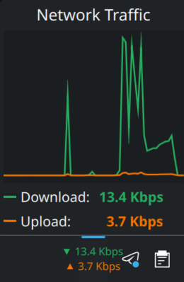

# netmon-plasmoid-rs

A KDE Plasma 6 panel applet showing real-time network traffic (Mbps), written in Rust using [cxx-qt](https://github.com/KDAB/cxx-qt).

This project is intended as a working reference for writing Plasma applets with Rust logic.




## Features

- Live download / upload speed in the panel compact view
- Popup with labeled download / upload and a scrolling sparkline
- Auto-detects the default network interface (no VPN double-counting)
- Background worker samples `/proc/net/dev` at a fixed 1 Hz cadence, independent of the QML side
- EMA-smoothed rates, handles counter resets and interface up/down without spurious spikes

## Prerequisites

- Rust (stable, 1.88+)
- KDE Plasma 6
- Qt 6 development headers: `qt6-base-devel`, `qt6-declarative-devel`
- A C++ compiler and `cmake` (used by cxx-qt's build system)
- `kpackagetool6` (part of `kpackage`)

On Arch Linux:
```sh
sudo pacman -S qt6-base qt6-declarative cmake kpackage
```

## Install

```sh
git clone https://github.com/youruser/netmon-plasmoid-rs
cd netmon-plasmoid-rs
bash install.sh --release --restart
```

On first install, log out and back in so plasmashell picks up the new QML plugin path. After that, `--restart` handles it.

Then right-click the panel → **Add Widgets** → search **Network Monitor** → drag to panel.

### Iterating on the code

```sh
bash install.sh --release --restart
```

That's it — rebuilds, reinstalls plugin + package, restarts plasmashell.

For quick QML-only changes (no Rust rebuild needed):

```sh
cp -r package/. ~/.local/share/plasma/plasmoids/org.kde.plasma.rustyapplet/
QML2_IMPORT_PATH=~/.local/lib/qt6/qml plasmoidviewer -a org.kde.plasma.rustyapplet
```

## Project structure

```
netmon-plasmoid-rs/
├── src/
│   ├── lib.rs          # cdylib root; forces Qt plugin symbol into .so
│   └── bridge.rs       # cxx-qt bridge: defines NetworkMonitor QObject
├── package/
│   ├── metadata.json   # Plasma applet identity and metadata
│   └── contents/ui/
│       └── main.qml    # PlasmoidItem with compact + full representation
├── build.rs            # cxx-qt-build setup + version script linker flag
├── plugin.version      # Linker version script: exports qt_plugin_instance
├── Cargo.toml
└── install.sh          # Build, install, optionally restart plasmashell
```

## Architecture

### Why `cdylib` + version script instead of CMake?

The official cxx-qt approach uses `staticlib` + CMake to build the shared Qt plugin library. CMake handles symbol visibility and Qt plugin registration automatically.

We skip CMake entirely by:

1. Building as `cdylib` with `PluginType::Dynamic` in `build.rs`
2. Using a **linker version script** (`plugin.version`) to export `qt_plugin_instance` and `qt_plugin_query_metadata_v2` as dynamic symbols — the two entry points Qt's QML engine looks for via `dlsym`
3. Referencing `qt_plugin_instance` from a `#[used] #[no_mangle] static` in `lib.rs` to prevent the linker from dropping it as dead code

### Why are `cxx` and `cxx-gen` version-pinned?

`cxx-qt 0.8.1` was released against `cxx 1.0.176`. The `cxx-gen` crate embeds its patch version into ABI symbol names (e.g. `cxxbridge1$176$...`). If Cargo resolves `cxx` to a newer version, the Rust-side and C++-side symbols won't match, causing linker errors. Additionally, `cxx 1.0.177+` changed how `include!(<...>)` is parsed in proc macro output, breaking the `cxx_qt::bridge` macro.

Pinning both crates locks the ABI:

```toml
cxx = "=1.0.176"          # [dependencies]
cxx-gen = "=0.7.176"      # [build-dependencies]
```

### How a cxx-qt bridge works

`bridge.rs` defines the Rust↔Qt interface:

```rust
#[cxx_qt::bridge]
pub mod qobject {
    extern "RustQt" {
        #[qobject]
        #[qml_element]
        #[qproperty(f64, rx_speed)]     // bytes/sec, EMA-smoothed
        #[qproperty(f64, tx_speed)]
        #[qproperty(QString, iface)]    // currently monitored interface
        #[qproperty(bool, link_up)]
        #[qproperty(QString, error)]
        type NetworkMonitor = super::NetworkMonitorRust;

        #[qinvokable]
        fn start(self: Pin<&mut Self>); // spawns the worker thread
    }

    impl cxx_qt::Threading for NetworkMonitor {}
}
```

`cxx-qt-build` in `build.rs` generates the C++ glue code at build time. The Rust struct (`NetworkMonitorRust`) holds the state; the QObject wrapper is managed by Qt.

### Threading model

QML calls `monitor.start()` once in `Component.onCompleted`. That spawns a dedicated worker thread which owns all the sampling logic:

1. Every tick it resolves the default interface from `/proc/net/route` and reads the rx/tx byte counters from `/proc/net/dev` (no `sysinfo`, no allocations on the hot path — the read buffer is reused).
2. It computes a real bytes-per-second rate from the delta between samples, resetting the baseline on interface change, counter decrease, or iface disappearance so you never see a spurious spike.
3. An EMA filter (α = 0.4) smooths the rate before it's published.
4. Updated values are pushed to the QObject via `cxx_qt::Threading::qt_thread().queue(...)`, which marshals the setter calls back onto the GUI thread. Property change signals fire automatically and QML bindings re-evaluate.

The tick cadence is driven by `mpsc::Receiver::recv_timeout`, which means the sleep is cancellable: dropping the `Sender` stored on the QObject (on plasmoid removal, via the Rust struct's `Drop`) wakes the worker immediately and it exits cleanly. No detached threads leak across reloads.

The QML side no longer drives sampling — its `Timer` only samples the already-pushed `rx_speed` / `tx_speed` into a ring buffer for the sparkline. Worker owns the cadence; QML owns the display.

### QML side

The applet uses Plasma's `PlasmoidItem` as root, which integrates with the panel:

- `compactRepresentation` — what appears in the panel bar
- `fullRepresentation` — the popup shown when clicked, including the sparkline Canvas

## License

MIT
